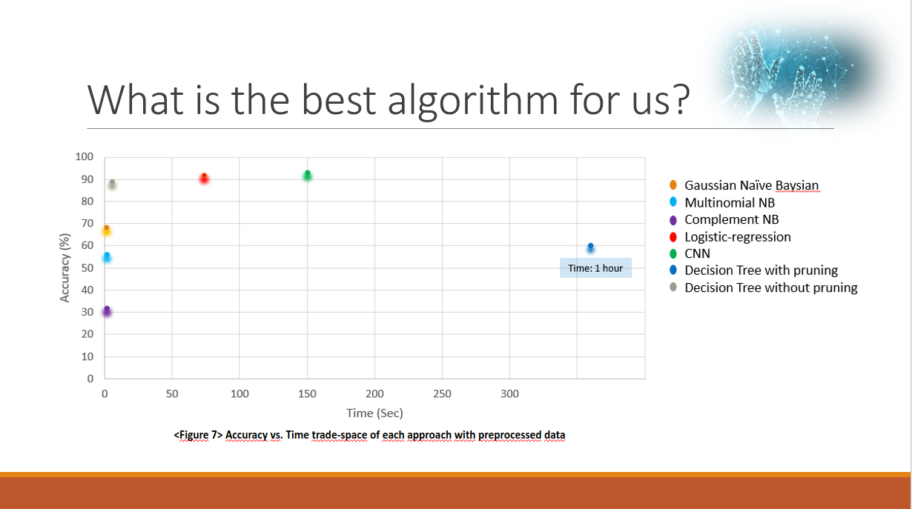

# AUTOMATED RECOGNITION OF ENGLISH ASL ALPHABET_EECE5644_FINAL_PROJECT_TEAM 5

<B>How to run</B>

Each source code was uploaded to each folder based on their feature.
- Baseline classifier
- Decision Tree
- Image preprocessing
- Validation

You can download images from the input folder. Preprocessed csv dataset will be created at your end once you run the preprocessing code.
