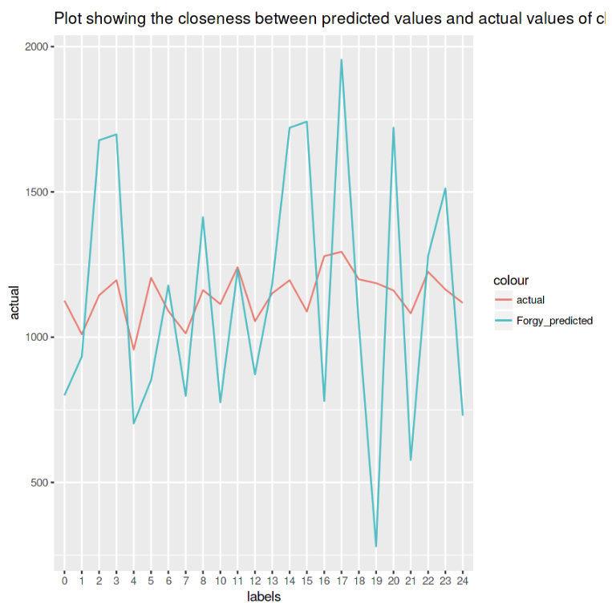
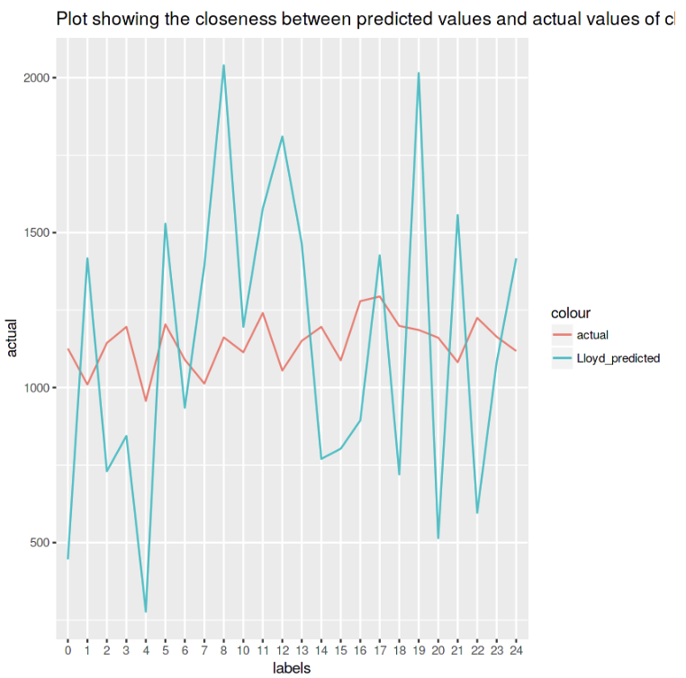
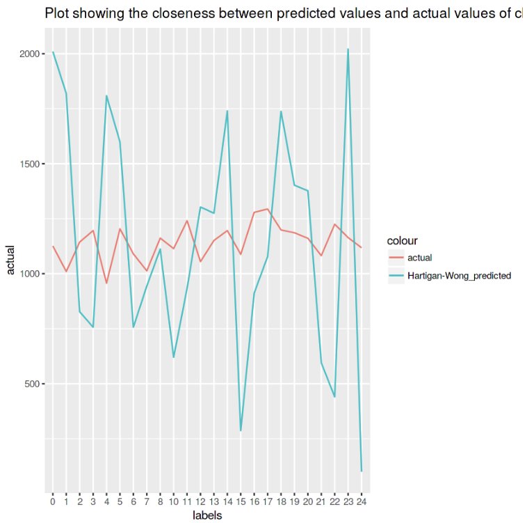

[Quantatitive value of prediction accuracy using KMeans for clustering analysis]
================================================================================
0.696458449525934
<B>"Prediction Accuracy is 69.65 %"</B>

IMPLEMENTATION OF K-MEANS ALOGORITHM :
In order to use the K-Means algorithm in R, one must have the stats package installed. 
This package includes a function that performs the K-Mean process, according to different algorithms. 
These algorithms are described below.
The syntax for kmeans is:
kmeans(x, centers, iter.max = 10, nstart = 1, algorithm = c("Hartigan-Wong", "Lloyd", "Forgy", "MacQueen")) where the arguments are:
-x : A numeric matrix of data, or an object with  all numeric columns.
-centers : Either the number of clusters or a set of initial (distinct) cluster centers.
-iter.max: The maximum number of iterations allowed.
-nstart : If centers is a number, nstart gives the number of random sets that should be chosen.
-algorithm : The algorithm to be used. It should be one of "Hartigan-Wong", "Lloyd", "Forgy" or "MacQueen".

[Plot of each KMeans Algorithm]========================================
Plot showing the closeness between predicted values and actual values of clusters for Forgy algorithm

Plot showing the closeness between predicted values and actual values of clusters for Llyod algorithm

Plot showing the closeness between predicted values and actual values of clusters for Hartigan-Wong algorithm

